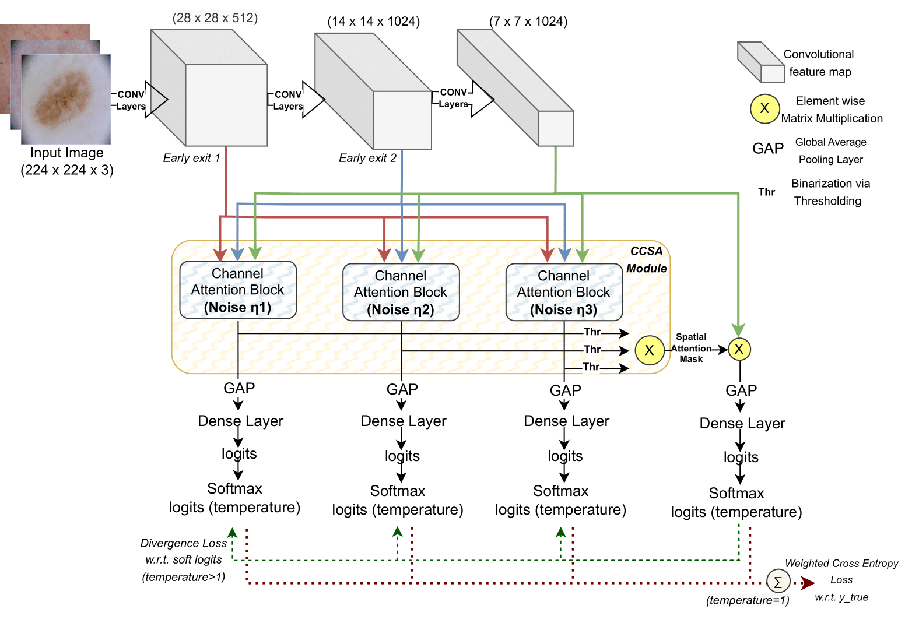

# Noise Perturbed MultiBranch Image Classification
Multi-branch Attention-aided Noise-regulated Network (MAN-Net)
to address these issues. MAN-Net integrates features from
diverse depths of a Convolutional Neural Network (CNN)
backbone, forming multiple secondary branches under
the assumption that shallow-level features govern low-
level details, while deeper-level features capture more fine
nuances. To address the triviality in structurally similar
branches, input features for these branches are regulated
with varying noise levels to enhance robust feature cap-
turing capability. These branches incorporate Collaborative
Channel and Spatial Attention (CCSA) module, which aims
to enhance the discriminative ability using consecutive
channel and spatial attention mechanisms. Channel atten-
tion prioritizes feature representability, and spatial atten-
tion emphasizes the most discriminative spatial position.
Independently training secondary branches with noise reg-
ularization and minimizing weighted cross-entropy (WCE)
loss relative to ground truth mitigates overfitting and im-
proves generalization

